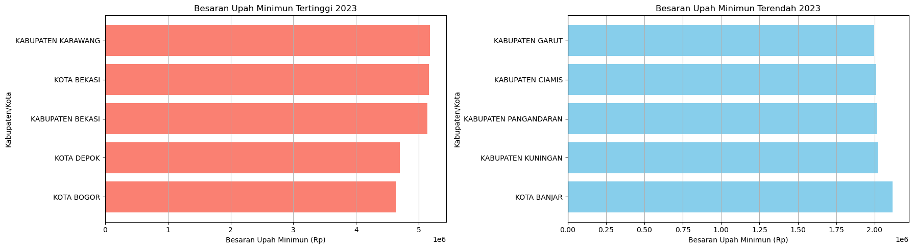
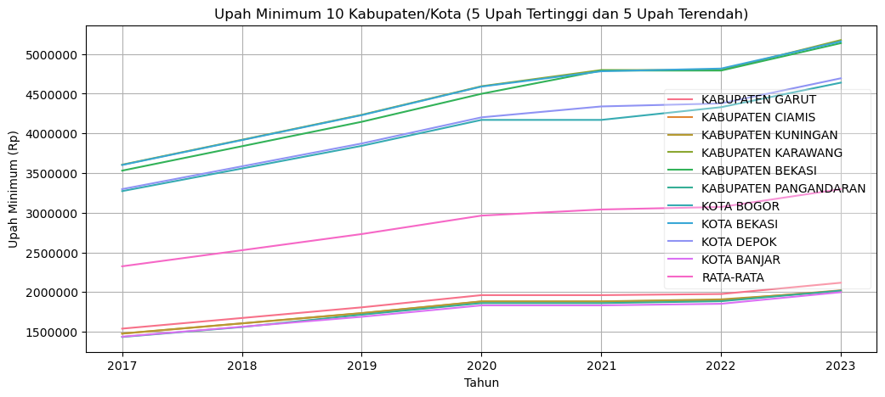
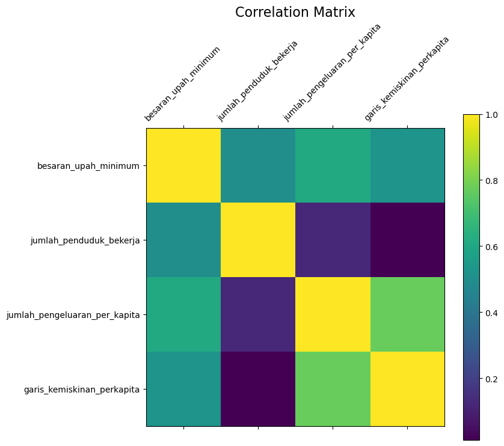
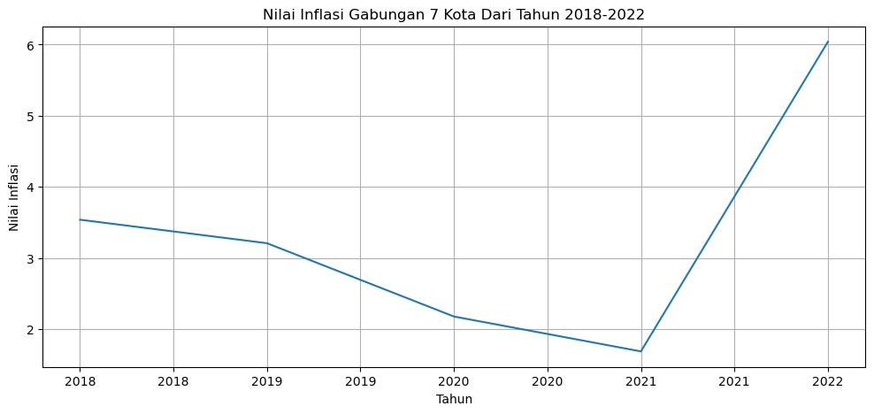

# EDA Wilayah Kerja di Jawa Barat

[](https://www.python.org/)
[](https://pandas.pydata.org/)
[](notebooks/eda-jawa-barat-wilayah-kerja.ipynb)
[](https://colab.research.google.com/github/boyaditya/eda-jawa-barat-wilayah-kerja/blob/main/notebooks/eda-jawa-barat-wilayah-kerja.ipynb)
[](data/DICTIONARY.md)

> Di mana sebaiknya bekerja di Jawa Barat? Analisis ini membandingkan **27 kabupaten/kota** berdasarkan **Upah Minimum (UMK), Pengeluaran per Kapita, Jumlah Penduduk Bekerja, Garis Kemiskinan, dan Inflasi** untuk membantu pengambilan keputusan.

**Notebook utama:** [`notebooks/eda-jawa-barat-wilayah-kerja.ipynb`](notebooks/eda-jawa-barat-wilayah-kerja.ipynb) · **Laporan PDF:** [`docs/eda-kelompok-3-v2.pdf`](docs/eda-kelompok-3-v2.pdf) · **Kamus data:** [`data/DICTIONARY.md`](data/DICTIONARY.md)

## Pratinjau

| UMK 5 Tertinggi vs 5 Terendah (2023) | Tren UMK 2017–2023 |
|---|---|
|  |  |

| Matriks Korelasi | Inflasi 7 Kota |
|---|---|
|  |  |

## Temuan kunci

1. **UMK 2023 timpang:** Tertinggi **Kab. Karawang Rp5.176.179**, Kota Bekasi, Kab. Bekasi, Kota Depok, Kota Bogor (≈ Rp4,6–5,1 jt). Terendah **Kota Banjar Rp1.998.119**, Kab. Kuningan, Pangandaran, Ciamis, Garut (≈ Rp2,0–2,1 jt).
2. **Tren naik:** Rata-rata UMK 10 kab/kota contoh naik konsisten 2017–2023.
3. **Korelasi kuat:**
   - UMK ↔ Pengeluaran per kapita **0,61**
   - UMK ↔ Garis kemiskinan **0,52**
   - UMK ↔ Penduduk bekerja **0,50**
   - Pengeluaran ↔ Garis kemiskinan **0,77** (paling kuat)
   - Penduduk bekerja ↔ Pengeluaran **0,13** dan ↔ Garis kemiskinan **0,01** (lemah — banyak pekerja ≠ daya beli tinggi).
4. **Inflasi beda level:** Rata-rata 2018–2022 tertinggi Kota Bekasi (3,66%) dan Bandung (3,48%), terendah Cirebon (2,53%). Lonjakan 2022 (rata-rata 5,96%) vs 2021 (1,67%).
5. **Implikasi praktis:** Kawasan industri timur (Karawang–Bekasi) unggul di UMK nominal, tapi garis kemiskinan & pengeluaran juga lebih tinggi — putuskan dengan biaya hidup, bukan UMK saja.

## Pertanyaan penelitian

1. Kab/kota mana dengan UMK 5 tertinggi & 5 terendah tahun 2023?
2. Bagaimana tren UMK beberapa tahun terakhir?
3. Bagaimana korelasi pengeluaran per kapita, UMK, penduduk bekerja, dan garis kemiskinan?
4. Bagaimana persebaran (distribusi/boxplot) keempat variabel tersebut?

Jawaban lengkap + grafik ada di notebook dan Bab Kesimpulan di akhir notebook.

## Dataset

Sumber: **Open Data Jabar — BPS & Disnakertrans**, Provinsi JAWA BARAT (kode 32).

| File di `data/raw/` | Isi | Rentang | Baris |
|---|---|---|---|
| `bps-od_17106_..._data.csv` | Pengeluaran per kapita (RIBU RUPIAH) | 2010–2022 | 348 |
| `disnakertrans-od_19868_..._data.csv` | Upah minimum (RUPIAH) | 2017–2023 | 189 |
| `disnakertrans-od_15793_..._data.csv` | Penduduk bekerja (ORANG, 2016 kosong) | 2011–2022 | 293 |
| `bps-od_17110_..._data.csv` | Garis kemiskinan/kapita/bulan (RUPIAH) | 2018–2020 | 81 |
| `bps-od_17137_..._data.csv` | Inflasi 7 kota + gabungan (PERSEN) | 2018–2022 | 40 |

Detail kolom: [`data/DICTIONARY.md`](data/DICTIONARY.md). Irisan aman untuk gabungan 4 variabel: **2018–2020**.

## Cara menjalankan

**Opsi 1 — Colab (paling cepat):** klik badge `Open in Colab` di atas.

**Opsi 2 — Lokal:**

```bash
git clone https://github.com/boyaditya/eda-jawa-barat-wilayah-kerja.git
cd eda-jawa-barat-wilayah-kerja
pip install -r requirements.txt
jupyter lab notebooks/eda-jawa-barat-wilayah-kerja.ipynb
```

> Path data di notebook sudah relatif (`../data/raw/`), jadi bisa jalan dari folder `notebooks/`.

## Struktur repo

```
.
├── README.md
├── requirements.txt
├── .gitignore
├── data/
│   ├── DICTIONARY.md
│   └── raw/                  # 5 CSV final (sumber Open Data Jabar)
├── notebooks/
│   └── eda-jawa-barat-wilayah-kerja.ipynb   # analisis utama (dari V2)
├── docs/
│   ├── eda-kelompok-3-v2.pdf                # ekspor PDF V2
│   └── archive/v1/                          # arsip V1 (notebook + CSV + PDF lama)
└── assets/
    ├── preview-umk-tertinggi-terendah-2023.png
    ├── preview-tren-umk.png
    ├── preview-korelasi.png
    └── preview-inflasi.png
```

## Metode singkat

1. **Cleaning:** drop kolom administratif (`id`, kode, `satuan`), cek NaN & zero-value, nilai 0 pada penduduk bekerja diimputasi rata-rata.
2. **Normalisasi Min-Max** untuk perbandingan lintas variabel (UMK, penduduk bekerja, pengeluaran, garis kemiskinan).
3. **Visualisasi:** bar Top/Bottom 5 UMK 2023, line tren + rata-rata, matriks korelasi, boxplot sorted, pairplot regresi, tren inflasi.
4. Tiap grafik langsung diikuti `## Kesimpulan` + kesimpulan eksekutif di akhir notebook.

## Keterbatasan

- Garis kemiskinan hanya 2018–2020 → analisis gabungan di luar itu ekstrapolatif.
- Data penduduk bekerja bolong tahun 2016.
- Inflasi hanya 7 kota (2018–2022), tidak mewakili 27 kab/kota.
- Ini EDA deskriptif, bukan model kausal/prediksi UMK.

## Tim — Kelompok 3

1. Boy Aditya Rohmaulana (2203488)
2. Defrizal Yahdiyan Risyad (2206131)
3. Muhamad Furqon Al-Haqqi (2207207)
4. Raya Cahya Nurani (2205714)
5. Septiani Eka Putri (2206000)

Dibuat awal 24 Sep 2023, diperbaiki 1 Okt 2023.
